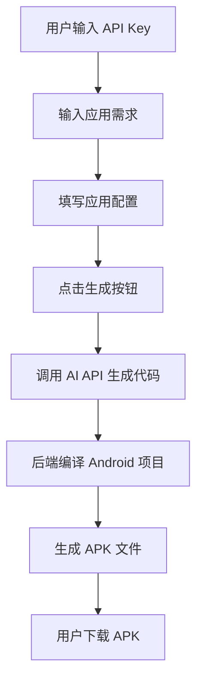

# APK生成器 - 产品需求文档

## 1. 产品概述

一个在线 Web 应用，用户输入 AI API Key 和应用需求描述，系统自动生成并下载 APK 格式的 Android 安装包。

目标用户：需要快速创建简单 Android 应用但不懂编程的用户。

## 2. 核心功能

### 2.1 用户角色
| 角色 | 注册方式 | 核心权限 |
|------|----------|----------|
| 访客用户 | 无需注册 | 直接使用全部功能 |

### 2.2 功能模块
1. **首页/生成页面**：
   - API Key 输入区
   - 应用需求描述区（多行文本）
   - 应用名称输入
   - 包名输入（可选，自动生成）
   - 生成按钮
   - 进度展示区
   - APK 下载区

### 2.3 页面详情
| 页面名称 | 模块名称 | 功能描述 |
|----------|----------|----------|
| 生成页 | API配置区 | 输入 AI API Key，支持 OpenAI/Claude 等 |
| 生成页 | 需求输入区 | 多行文本框描述想要的 App 功能和外观 |
| 生成页 | 应用配置 | 应用名称、包名等基本信息 |
| 生成页 | 生成进度 | 显示代码生成、编译 APK 的实时进度 |
| 生成页 | 下载区 | 生成的 APK 文件下载按钮 |

## 3. 核心流程

### 3.1 主流程
1. 用户输入 AI API Key
2. 用户输入应用需求描述
3. 用户输入应用名称和包名
4. 点击"生成 APK"按钮
5. 系统调用 AI API 生成 Android 项目代码
6. 系统自动编译生成 APK
7. 用户下载 APK 文件

### 3.2 流程图

## 4. 用户界面设计

### 4.1 设计风格
- **主题**：深色科技风格，突显 AI 和代码生成的神秘感
- **主色调**：深紫色 #6B21A8，辅助色为青色 #06B6D4
- **按钮风格**：圆角按钮，悬停时有发光效果
- **字体**：使用 JetBrains Mono 作为代码展示，Inter 作为界面文本
- **布局**：单页应用，居中卡片式设计
- **动效**：生成过程中的脉冲动画、进度条动画

### 4.2 页面设计
| 页面 | 模块 | 样式描述 |
|------|------|----------|
| 生成页 | 背景 | 深色渐变 + 网格纹理 + 粒子效果 |
| 生成页 | 主卡片 | 毛玻璃效果，半透明深色背景 |
| 生成页 | 输入框 | 深色背景，青色边框，聚焦时发光 |
| 生成页 | 生成按钮 | 紫色渐变，悬停时放大并发光 |
| 生成页 | 进度区 | 步骤指示器 + 进度条 + 日志输出 |
| 生成页 | 下载区 | APK 图标 + 文件名 + 下载按钮 |

### 4.3 响应式设计
- 桌面端：最大宽度 800px 的居中卡片
- 移动端：全宽显示，内边距适配

## 5. 技术架构

### 5.1 前端
- 纯 HTML/CSS/JavaScript 单文件应用
- 动画使用 CSS 动画 + 少量 JS 控制
- 无需框架，保持简单

### 5.2 后端（模拟演示）
- 由于真实 APK 生成需要 Android SDK 和编译环境
- 本演示版本将：
  - 展示完整的 UI 和交互流程
  - 模拟 API 调用和编译过程
  - 提供示例 APK 下载（预编译的演示应用）

### 5.3 路由定义
- `/` - 主页面（生成器界面）
