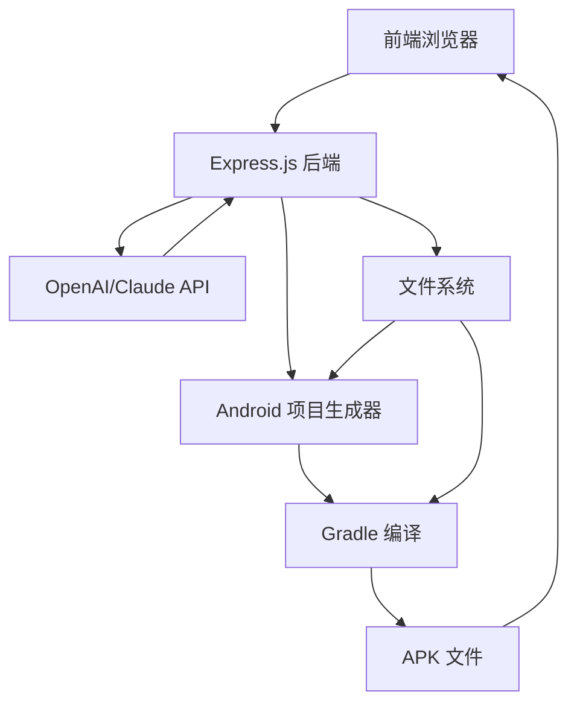

# APK生成器 - 技术架构文档

## 1. 架构设计



## 2. 技术选型

### 2.1 前端
- 纯 HTML5 + CSS3 + Vanilla JavaScript
- CSS 动画效果
- Google Fonts (Inter, JetBrains Mono)

### 2.2 后端
- **Runtime**: Node.js 18+
- **框架**: Express.js 4.x
- **AI 集成**: OpenAI SDK / Anthropic SDK
- **构建工具**: Gradle (via child_process)

## 3. 项目结构

```
/workspace
├── index.html          # 前端页面
├── server.js          # Express 服务器
├── package.json       # 依赖配置
├── projects/          # 生成的 Android 项目
│   └── {uuid}/
│       ├── app/       # Android 应用模块
│       └── build/     # Gradle 构建输出
└── downloads/         # 生成的 APK 文件
```

## 4. API 路由

| 路由 | 方法 | 用途 |
|------|------|------|
| `/api/generate` | POST | 提交生成任务 |
| `/api/status/:jobId` | GET | 查询生成状态 |
| `/api/download/:jobId` | GET | 下载生成的 APK |
| `/api/cancel/:jobId` | POST | 取消生成任务 |

## 5. API 请求/响应格式

### 5.1 POST /api/generate

**请求体:**
```json
{
    "apiKey": "sk-xxx",
    "apiProvider": "openai",
    "appName": "我的应用",
    "packageName": "com.example.myapp",
    "requirements": "一个简单的计算器应用..."
}
```

**响应:**
```json
{
    "jobId": "uuid-xxx",
    "status": "queued",
    "message": "任务已创建"
}
```

### 5.2 GET /api/status/:jobId

**响应:**
```json
{
    "jobId": "uuid-xxx",
    "status": "generating", // queued, generating, building, completed, error, cancelled
    "progress": 65,
    "logs": [
        "正在连接 AI 服务...",
        "AI 正在生成代码...",
        "项目结构已创建"
    ],
    "downloadUrl": null
}
```

### 5.3 GET /api/download/:jobId

返回 APK 文件流

## 6. 核心模块

### 6.1 前端模块
- **API 配置组件**: 输入 AI API Key，提供商选择
- **需求输入组件**: 多行文本框描述 App 需求
- **应用配置组件**: 应用名称、包名
- **进度展示组件**: 步骤指示器、进度条、日志
- **下载组件**: APK 信息卡、下载按钮

### 6.2 后端模块
- **JobManager**: 任务队列管理
- **AICodeGenerator**: 调用 AI API 生成代码
- **AndroidProjectBuilder**: 创建 Android 项目结构
- **GradleBuilder**: 执行 Gradle 编译
- **FileManager**: 文件系统操作

## 7. 状态机

```
idle → queued → generating → building → completed
                  ↓
               error ←─── cancelled
```

## 8. Android 项目生成流程

1. 创建项目目录结构
2. 生成 `settings.gradle`, `build.gradle`
3. 生成 `app/build.gradle`
4. 生成 `AndroidManifest.xml`
5. 生成主 Activity 和布局文件
6. 调用 Gradle 构建 debug APK
