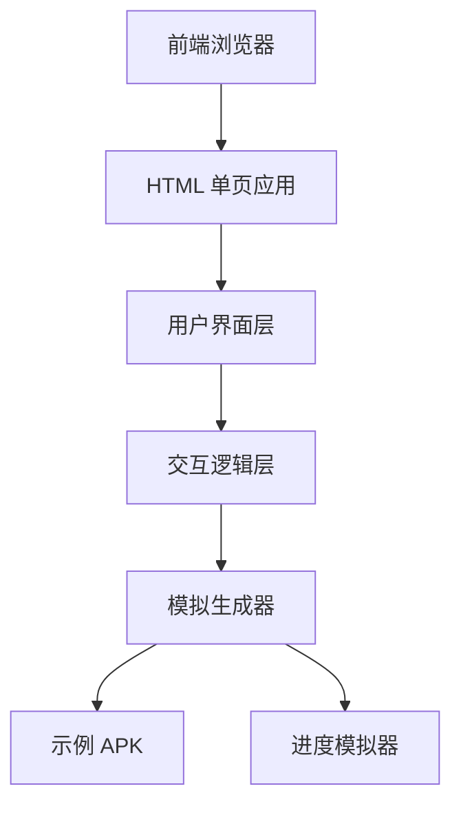

# APK生成器 - 技术架构文档

## 1. 架构设计



## 2. 技术选型

- **前端**：纯 HTML5 + CSS3 + Vanilla JavaScript
- **样式**：自定义 CSS（含 CSS 变量）
- **动画**：CSS 动画 + CSS transitions
- **图标**：内联 SVG
- **字体**：Google Fonts (Inter, JetBrains Mono)

## 3. 页面结构

| 路由 | 用途 |
|------|------|
| `/index.html` | 主页面 - APK 生成器界面 |

## 4. 核心模块

### 4.1 API 配置模块
- 输入框：API Key（密码类型）
- 下拉选择：API 提供商（OpenAI / Claude / 自定义）
- 输入框：API Endpoint（自定义时）

### 4.2 需求输入模块
- 多行文本框：应用需求描述
- 输入框：应用名称
- 输入框：包名（可选）

### 4.3 生成控制模块
- 生成按钮：触发模拟生成流程
- 取消按钮：中断生成过程

### 4.4 进度展示模块
- 步骤指示器：显示当前步骤
- 进度条：视觉化进度
- 日志区域：滚动显示生成日志

### 4.5 下载模块
- APK 信息卡片
- 下载按钮
- 文件大小显示

## 5. 状态管理

```javascript
state = {
    apiKey: '',
    apiProvider: 'openai',
    appName: '',
    packageName: '',
    requirements: '',
    status: 'idle', // idle, generating, completed, error
    progress: 0,
    logs: [],
    downloadUrl: null
}
```

## 6. 模拟生成流程

1. **初始化** (0-5%)
2. **连接 API 服务** (5-15%)
3. **发送需求描述** (15-25%)
4. **等待 AI 响应** (25-60%)
5. **生成 Android 项目代码** (60-75%)
6. **编译 APK** (75-90%)
7. **完成** (90-100%)

## 7. 示例 APK

演示版本包含一个预编译的示例 APK，功能为：
- 显示用户输入的应用名称
- 展示一个简单的欢迎界面
- 显示当前日期时间
